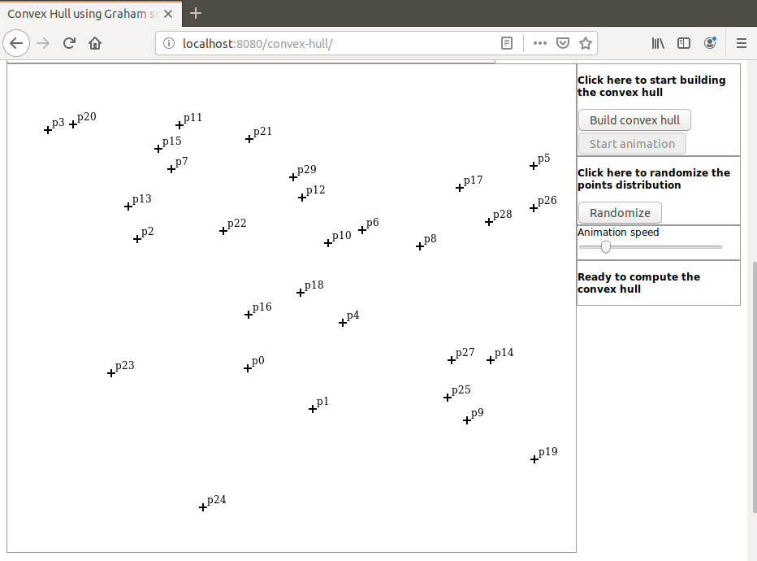
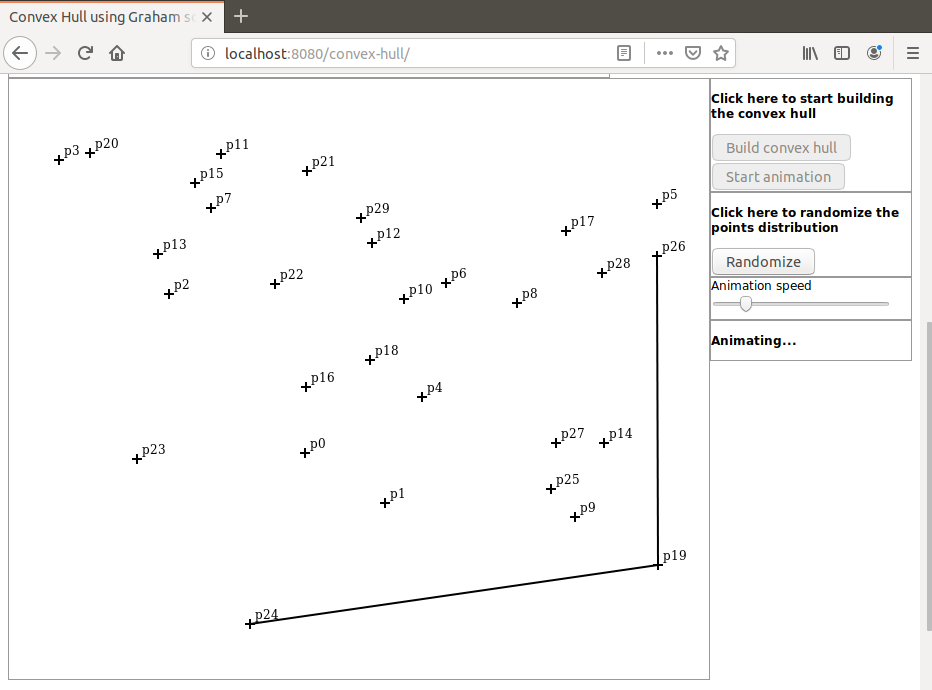
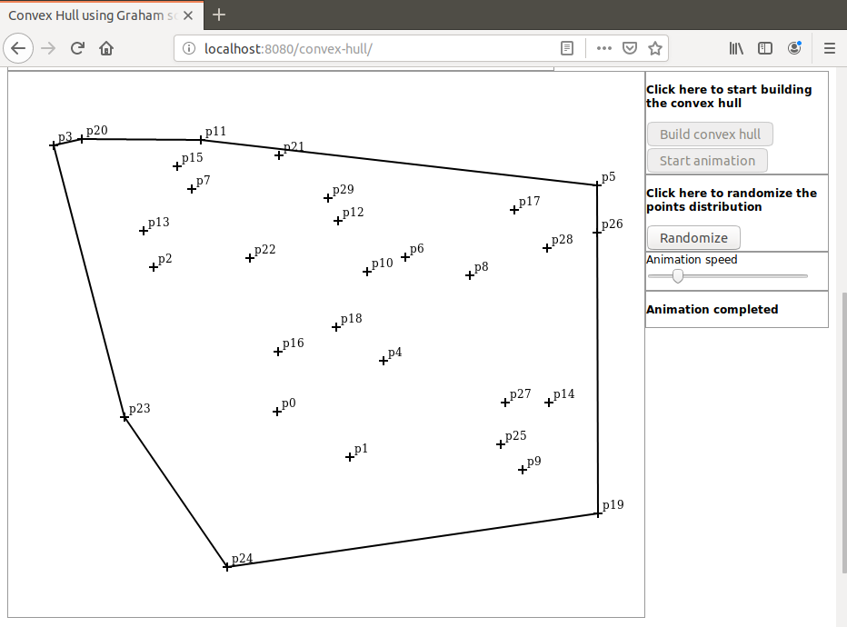

# graham-anim
I present here a Java based demonstration of the Graham Scan algorithm that is used to find the convex hull of a random points distribution.

Javascript is used for display and initialization only. Here are the implementation details:

A random points distribution is created (browser side)

The distribution is sent to the server as a JSON object.

Then the Graham Scan is executed (server side).

All intermediate results are saved as a collection.

This collection is sent to the browser as a JSON object.

The collection is used for animation.

# Launching the demo
To launch the demo run the command `mvn spring-boot:run` in project directory. When the application has started open a browser and hit URL `localhost:8080/convex-hull`

Here are some screen shots that can be seen during the demo:

After the points distribution was initialized:

Animation step:

Animation completed:

For a step-by-step demonstration of the Graham Scan algorithm please visit this repository:

https://github.com/dubersfeld/graham-step

For a demonstration of the Jarvis March algorithm please visit this repositories:

https://github.com/dubersfeld/jarvis-step

https://github.com/dubersfeld/jarvis-anim

Dominique Ubersfeld, Cachan, France
